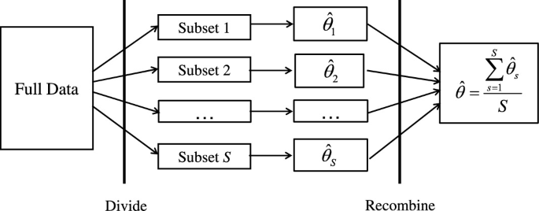
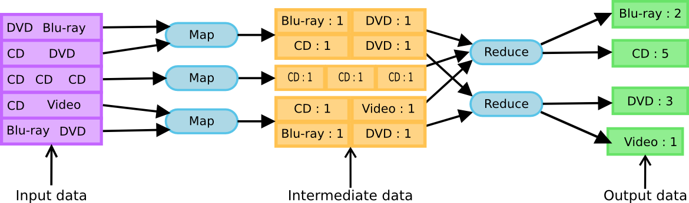
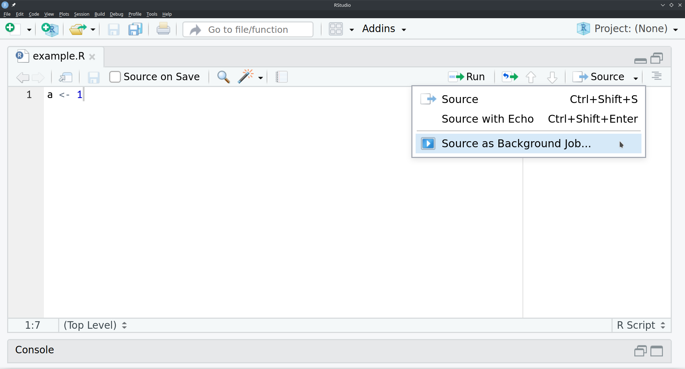

```{r setup, include=FALSE}
knitr::opts_chunk$set(echo = TRUE)
Sys.setenv(LANGUAGE = "en_US.UTF-8")
Sys.setenv(LC_ALL = "en_US.UTF-8")
Sys.setenv(LC_ADDRESS = "nb_NO.UTF-8")
Sys.setenv(LC_NAME = "nb_NO.UTF-8")
Sys.setenv(LC_MONETARY = "fr_FR.UTF-8")
Sys.setenv(LC_PAPER = "nb_NO.UTF-8")
Sys.setenv(LC_IDENTIFICATION = "nb_NO.UTF-8")
Sys.setenv(LC_TELEPHONE = "nb_NO.UTF-8")
Sys.setenv(LC_MEASUREMENT = "nb_NO.UTF-8")
Sys.setenv(LC_TIME = "en_150.UTF-8")
Sys.setenv(LC_NUMERIC = "en_US.UTF-8")
library(foreach)
library(doFuture)
```

# How to achieve high performance

## Specialization

\small

### Hardware

* Powerful CPU
* Recent CPU
* CPUs with instruction sets AES-NI / AVX / other
* GPUs for image processing

### Software

* `ADMB`, `TMB`
* BLAS (Basic Linear Algebra Subroutines) libraries for basic vector and matrix operations
* LAPACK (Linear Algebra Package) libraries for solving systems of equation, matrix factorization, eigenvalue
* Approximations
* Automatic parallelization by the compiler (e.g. Haskell)

### Both
* Parallelization

\normalsize

# Introduction to parallel processing

## Terminology

### Hardware
* **Processor / CPU**: Electrical circuit that performs basic operations on external data.
* **Core**: Processing unit.
* **Cluster**: Collection (of machines/cores).

### Software
* **Thread**: Sequence of instructions in a process.
* **Process**: Running instance of `R`.
* **Socket**: Duplicated process, uses duplicated memory.
* **Fork**: Duplicated process, uses copy-on-write mechanism.

### Language update
~~Master/slave~~ main/worker, parent/child, chief/worker...

## Types

### Socket
* Works on any system and on clusters
* Uses more resources
* Little slower

### Forking
* Single machine
* Unix-like operating systems e.g. Linux distributions and macOS
* Uses less resources
* Little faster

## Brief history

* `snow` (Simple Network of Workstations) (2003) with `doSNOW`
* `multicore` (2009) with `doMC` (uses forking)

Wrappers:

* `parallel` (2011) with `doParallel`
* `future` (2015) with `dofuture`

More details at https://cran.r-project.org/web/views/HighPerformanceComputing.html

## Where to parallelize

When all tasks are independent, so-called embarrassingly parallel problems (or perfectly, delightfully, pleasingly)

* Monte-Carlo simulations
* Numerical integration
* Computer graphics
* Brute-force searches in cryptography
* Search of hyper parameters in machine learning
* Genetic optimization algorithms
* Cross-validation
* Random forests

Non-embarrassingly parallel problems are more difficult to parallelize.

## Should I parallelize? (1)
Time required to write the code & overhead & resources v.s. speedup.

\begin{block}{Amdahl's law (1967)}
Maximum speedup in latency (inverse of task speed)
\[
S(N, p) = \frac{T}{T_{N \text{ cores}}} = \frac{(1-p)T + pT}{(1-p)T + \frac{pT}{N}} = \frac{1}{1-p+\frac{p}{N}}
\]
\begin{itemize}
  \itemsep 0em
  \item \(S\) = speedup of the task's latency
  \item \(N\) = cores
  \item \(p\) = \% task benefiting from parallelization
  \item \(T\) = time with 1 core
\end{itemize}
\end{block}

\begin{block}{Example}
If 50\% of a problem is sped up (\(p = 0.5\)) by a factor of 10 (\(N = 10\)), then the maximum speedup is \(S(2, 0.5) = 1.82\).
\end{block}

## Should I parallelize? (2)
\begin{block}{Gustafson's law (1988)}
\[
S(N, p) = \frac{T}{T_{N \text{ cores}}} = \frac{(1-p)T + NpT}{(1 - p) T + \frac{NpT}{N}} = 1 + p(N - 1)
\]
\begin{itemize}
  \itemsep 0em
  \item \(S\) = speedup of the task's latency
  \item \(N\) = cores
  \item \(p\) = \% task benefiting from parallelization
  \item \(T\) = time with 1 core before parallelization
\end{itemize}
\end{block}

Assumes that the parallelizable work is multiplied by \(N\) when parallelized.

\begin{block}{Example}
If 50\% of a problem is sped up (\(p = 0.5\)) by a factor of 10 (\(N = 10\)), then the maximum speedup is \(S(2, 0.5) = 5.5\).
\end{block}

## Should I parallelize? (3)
\begin{block}{Sun-Ni's law (1990), memory-bounded speedup, simplified}
\[
S(N, p) = \frac{T}{T_{N \text{ cores}}} = \frac{(1-p)T + g(N)pT}{(1 - p) T + \frac{g(N)pT}{N}} = \frac{(1-p) + g(N)p}{(1 - p)  + \frac{g(N)p}{N}}
\]
\begin{itemize}
  \itemsep 0em
  \item \(S\) = speedup of the task's latency
  \item \(N\) = cores
  \item \(p\) = \% task benefiting from parallelization
  \item \(T\) = time with 1 core before parallelization
\end{itemize}
\end{block}

Assumes that the parallelizable work is multiplied by \(g(N)\) when parallelized.

## Parallel slowdown

Non-embarrassingly parallel tasks require communication between processes, which slows down the program.

```{r, echo = FALSE, fig.cap = "", fig.height=5}
cores <- 1:13
speedup <- c(1:8, 8.5, 9, 9.2, 9, 8.5)
plot(x = cores,
     y = speedup,
     xlab = "Processors",
     ylab = "Speedup",
     ylim = c(0, 11),
     yaxt = "n")
lines(x = 1:11,
      y = 1:11)
```

# Embarassingly parallel problem
## Big Data

Divide and recombine [@guha]



# Non-embarassingly parallel problems
## Big Data

Map Reduce [@dean]



# Examples

## Natively on RStudio



## `future`
No worries about

* exporting variables (`clusterExport`)
* packages (`clusterEvalQ`)
* which `apply` function to use (`parLapply`,  `mclapply`)
* which parallel back-end to use (`snow`, `multicore`, etc)
* which operating system (Windows, macOS, Linux)

## `future` basics (1)
\tiny
```{r}
a <- sum(1:100) # Sequential
a

library(future)
plan(multisession)
# Method 1
fb <- future({ sum(1:50) })
fc <- future( sum(51:100) )
aa <- value(fb) # wait until future is resolved
aa <- aa + value(fc)
aa
# Method 2
fb %<-% { sum(1:50) }
fc %<-% sum(51:100)
# fc %<-% 1 + 1
aaa <- fb + fc
aaa
```
\normalsize

## `future` basics (2)
`apply` and `map` functions
\tiny
```{r}
library(future.apply)
plan(multisession)
a <- future_lapply(1:5, sum)
identical(a,
          lapply(1:5, sum))
# future_replicate()
# future_sapply()
# future_apply()

library(furrr) # futurized `purrr` package
# future_map()
# future_map2()
# future_modify()
```
\normalsize

## `future` Nested loops

\tiny
```{r}
library(future)
library(listenv)
x <- listenv()
plan(list(multisession, sequential))
for (i in 1:3) {
  x[[i]] %<-% {
    
    y <- listenv()
    for (j in 1:3) {
      y[[j]] %<-% {
        return(c(Sys.getpid(), 10*i + j))
      }
    }
    return(y)
    
  }
}
unlist(x)
```
\normalsize

## `foreach`

Works with/out any parallel computation back-end

```{r}
library(foreach)
pids <- foreach(i = 1:2, .combine = "c") %do% {
  return(Sys.getpid())
}
pids
```

## `foreach` (2)
```{r}
library(doFuture)
registerDoFuture()
plan(multisession(workers = 2))
pids <- foreach(i = 1:2, .combine = "c") %dopar% {
  return(Sys.getpid())
}
pids
```

## `foreach` Nested loops

Usually, parallelize the outer loop.
\small
```{r eval=FALSE}
registerDoFuture()
plan(list(tweak(multisession, workers = 3),
          tweak(multisession, workers = 2)))
a <- foreach(i = 1:5) %dopar% {
  a <- foreach(j = 1:5) %dopar% {
    return(0)
  }
  return(0)
}
plan(multisession(workers = 2))
a <- foreach(i = 1:5) %:% {
  a <- foreach(j = 1:5) %dopar% {
    return(0)
  }
  return(0)
}
```
\normalsize

## `foreach` Chunking tasks
Each future will process `chunk.size` elements (on average).
\small
```{r}
registerDoFuture()
plan(multisession(workers = 2))
results <- foreach(i = 1:10,
                   .options.future = list(chunk.size = 3),
                   .combine = "c") %dopar% {
  return(Sys.getpid())
}
results
```
\normalsize

## `foreach` Randomness
Randomness is a problem.
```{r warning=FALSE}
set.seed(1)
registerDoFuture()
plan(multisession(workers = 2))
results <- foreach(i = 1:2, .combine = "c") %dopar% {
  return(rnorm(1))
}
results
set.seed(1)
rnorm(1)
```

## `foreach` Randomness solution
\small
```{r include=FALSE}
library(doRNG)
```

```{r}
library(doRNG)
registerDoFuture()
plan(multisession, workers = 2)
results <- foreach(i = 1:2, .combine = "c") %dorng% {
  return(rnorm(1))
}
results[2]
.Random.seed <- attr(results, "rng")[[2]]
rnorm(1)
```
\normalsize

## Monitoring

\small
```{r eval=FALSE}
library(mailR)
myemail <- "riw011@uib.no"
# Email
message <- "May the force be with you"
send.mail(from = myemail,
          to = myemail,
          subject = "Hello there",
          body = message,
          smtp = list(host.name = "smtp.uib.no",
                      user.name = myemail,
                      passwd = mypassword))
# Online service
system(paste0('curl -d "', message,'" ntfy.sh/aaaa'))
```
\normalsize

## Monitoring with progress bar
\tiny
```{r eval=FALSE}
library(doFuture)
library(progressr)
registerDoFuture()
plan(multisession(workers = 2))

# Monitoring this function
aa <- function() {
  p <- progressor(along = 1:10)
  foreach(i = 1:10) %dopar% {
    Sys.sleep(2)
    p() # Increment progress bar
    return(NULL)
  }
  return(NULL)
}

# Method 1
handlers(global = TRUE)
aa()

# Method 2
handlers(global = FALSE)
with_progress({
  aa()
})
```
\normalsize

## Monitoring

\movie[width=10cm,height=6cm]{Laplacian 2D}{monitoring_progress_bar.mp4}

## Race condition / concurrent writing
```{r include=FALSE, cache=TRUE}
file.create("log.txt", overwrite=TRUE)
file.remove("TRUE")
```

\tiny
```{r filelock-fail, warning=FALSE, cache=TRUE}
library(doFuture)
registerDoFuture()
plan(multisession, workers = 11)
a <- foreach(i = 1:1000) %dopar% {
  write("Dude", file = "log.txt", append = TRUE)
  write("where", file = "log.txt", append = TRUE)
  write("is", file = "log.txt", append = TRUE)
  write("my", file = "log.txt", append = TRUE)
  write("car", file = "log.txt", append = TRUE)
  return(NA)
}
fpeek::peek_tail("log.txt", n = 50, intern = TRUE)
```
\normalsize

## Race condition solution
`filelock` (does not work well) or `flock` package

```{r include=FALSE, cache=TRUE}
file.create("log2.txt", overwrite=TRUE)
file.remove("TRUE")
```

\tiny
```{r filelock-success, warning=FALSE, cache=TRUE}
library(doFuture)
registerDoFuture()
plan(multisession, workers = 11)
a <- foreach(i = 1:1000, .packages = "flock") %dopar% {
  
  mylock <- lock("lockfile")
  write("Hasta", file = "log2.txt", append = TRUE)
  write("la", file = "log2.txt", append = TRUE)
  write("vista", file = "log2.txt", append = TRUE)
  write("baby", file = "log2.txt", append = TRUE)
  unlock(mylock)
  
  return(NA)
}
fpeek::peek_tail("log2.txt", n = 50, intern = TRUE)
```
\normalsize

# Parallel computing at scale
\footnotesize
### Distributed computing

* Seti@Home with BOINC software
* Folding@Home, about protein folding
* Fold.it puzzle video game

### Apache Hadoop

Google's Map-Reduce

### Apache Spark

More efficient on smaller but still massive data sets

### More efficient tools

* Schedulers: SLURM
* MPI (Message Programming Interface) with package `rmpi` is de-facto standard
* Managing shared memory processes with e.g. POSIX Threads or OpenMP

e.g. [@devicente] uses specialized tools to manage a dynamic cluster of non-dedicated workstations
\normalsize

# References

<div id="refs"></div>